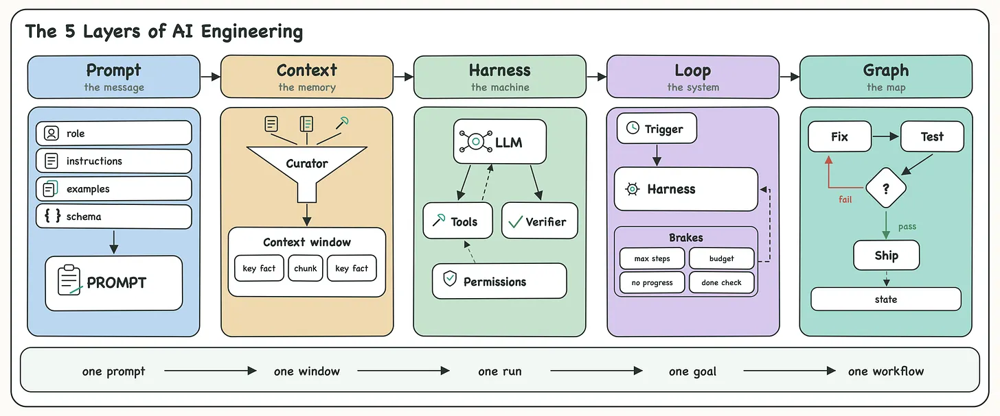

# The-5-Layers-of-Agentic-Engineering

## 1. Prompt Engineering: Get One Call Right

The prompt is everything the model sees in a single call. A role, instructions, a few examples, an output format.

Three rules cover most of the craft:

- One clear job per call, and what done looks like.
- An example or two that shows the quality you expect.
- A schema that locks the shape, so your code can parse it.

Prompt engineering is real work, and it has a ceiling. Most people hit that ceiling without noticing, and keep polishing the wording while the actual bottleneck sits outside the call.

👉 If your agent fails the same way no matter how you reword the prompt, you have outgrown this layer. Zoom out.

## 2. Context Engineering: Get One Window Right

Context is everything inside the model window it sees on a call: Prompt, queries, retrieved docs, memory, prior turns, and earlier tool outputs all compete for the same window.

The window is finite and fills up fast.

So the work here is curation: rank what goes in and cut everything that pulls no weight.

- Retrieve only the chunks relevant to the query, then rerank them.
- Keep key facts away from the middle of the window, where accuracy drops.
- Summarize old turns, compress tool outputs the moment they return, push big blobs to files.

I learned this on my own second brain AI solution. I stuffed the context with everything that might help, and the agent got slower and dumber with every addition.

❌ Dump everything in and hope the model sorts it out.

✅ Rank hard, cut dead weight, keep only what the task needs.

💡 You can still park the big stuff in files the agent can read on demand.

Memory and context are different jobs. Memory decides what your agent can know. Context decides what it uses on this call.

## 3. Harness Engineering: Get One Run Right

Agent = model + harness.

The model supplies the intelligence. The harness is the system around the model that turns intelligence into reliable action.

It assembles the prompt and context, connects the model to the outside world, and controls what happens during a run:

- Tools and subagents: defined by you, run by your code, with results fed back to the model so it can act again.
- Permissions: allowlists, sandboxes, and approval gates for destructive actions.
- Verification: runs tests, validates schemas, and refuses work that does not compile.
- Routing and recovery: chooses models and tools, handles failures, and retries when needed.

On Terminal Bench, moving the same model into a better harness lifted it from the top 30 to the top 5. Same model, same tasks. The harness made the difference.

One run is rarely one call. The model can ping-pong with tools and subagents through dozens of round trips. The harness keeps that run moving until a verified result comes out.

Whether that result actually meets the goal belongs to the next layer.

## 4. Loop Engineering: Get One Goal Right

In the default setup, you are the loop. You write a prompt, read the result, write the next prompt, and catch the failures by hand.

Loop engineering hands that job to the agent. It kicks off on a schedule or an event, runs many turns without you, and stops when the goal is met.

The hard part is the stop. A loop has no natural sense of done, and an agent will happily report success while the tests are still red. So the stop must be a signal it cannot fake:

- A run cap and a token budget to kill stuck runs.
- A no-progress detector for the agent repeating the same call.
- A completion check that verifies the goal with a test or a separate model.

I wrote a full issue on this layer, Loop Engineering 101, check it out for more info.

The main concern with loops is that the model has to find its own path to the goal. Across runs, it can take a different path to the same goal every time.

A more deterministic approach is to define the allowed paths yourself. That is the fifth layer:

## 5. Graph Engineering: Get the Whole Workflow Right

Graph engineering is about defining the workflow around the agent.

In a loop, you set the goal and let the agent decide what to do next. In a graph, you define the possible next steps in code.

If the tests fail, go back to the fix step. If they pass, move to review. If a human must approve, stop and wait. If two tasks are independent, run them in parallel.

That is the key difference: a loop decides dynamically; a graph follows explicit transitions.

The graph is the rails. The loop is the motor. The loop keeps the agent moving. The graph controls where it can go.

The payoff is control. You can checkpoint progress because you know exactly which step you are on. You can parallelize independent work. You can pause for human approval and resume hours or days later without losing state.

✅ Graphs are worth the extra setup when the workflow is known, repeated, needs approvals, or must survive restarts.

💡 For one-off tasks where you know the goal but not the path, a loop is usually enough.

## Find The Broken Layer

When your agent misbehaves, find the layer before you touch anything:

- Output format wrong: prompt problem.
- Model forgets facts you gave it: context problem.
- Tool calls flaky, nothing verifies the work: harness problem.
- Agent never stops, or stops before the job is done: loop problem.
- Work cannot pause, parallelize, or survive a restart: graph problem.

The fix compounds as you move out: a better prompt improves one call, a better harness improves every run, a better loop ships work while you sleep, and a better graph does that with ten agents at once.

## The Cheat Sheet

Think of your agent as a junior engineer:

- Prompt engineering is what you tell them.
- Context engineering is what you hand them.
- Harness engineering is where they work: tools, permissions, tests.
- Loop engineering is how they keep going without you.
- Graph engineering is which routes their work is allowed to take.

Or, more simply:

- Prompt is the message.
- Context is the memory.
- Harness is the machine.
- Loop is the system.
- Graph is the map.

One prompt, one window, one run, one goal, one workflow. Each layer out, you control more of the work.

Average developers engineer the prompt.

Great developers engineer the environment around it.
